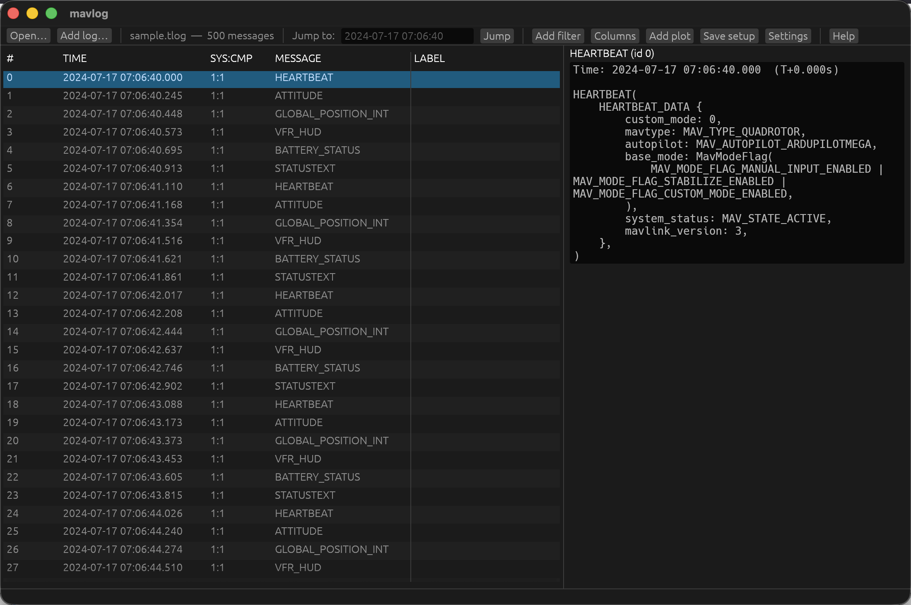
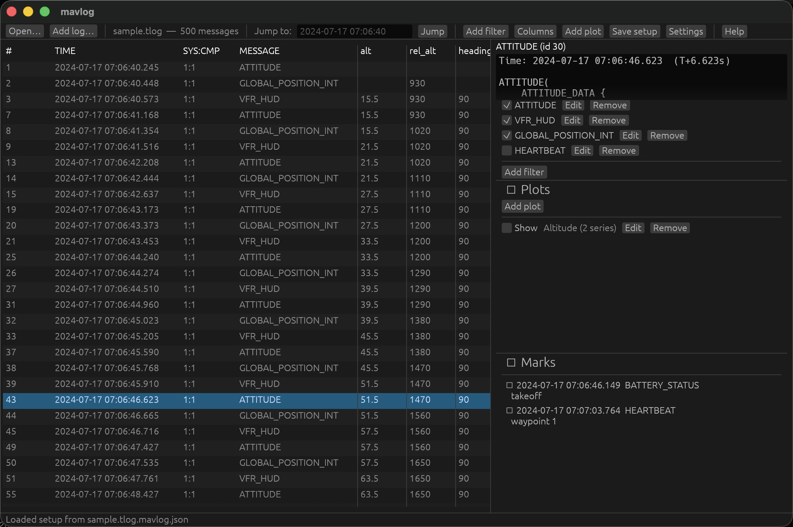
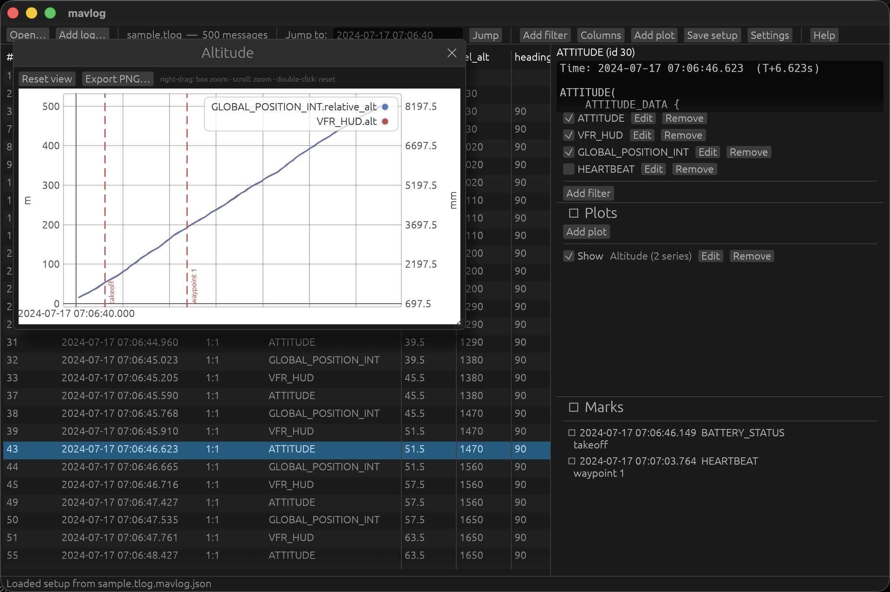

# mavlog

A fast, keyboard-driven viewer for **MAVLink `.tlog`** and **ArduPilot
DataFlash `.bin`** flight logs. Scroll and filter the message stream, read any
message decoded field-by-field, pin "last-seen value" columns, drop labelled
marks, jump to a moment in time, and graph any numeric field against time — all
from one window.



The log format is picked from the file extension (with a content-sniff
fallback). For `.bin` logs, field names, units and multipliers come straight
from the log's own embedded `FMT`/`FMTU` schema, and timestamps are shown
relative to boot.

## Features

- **Two log formats, one core** — MAVLink `.tlog` and ArduPilot DataFlash
  `.bin`, opened by extension or content sniff.
- **Decoded detail pane** — every field of the selected message, expanded and
  human-readable.
- **Filters** — show only the message types you care about; toggle each one on
  and off without deleting it.
- **Custom columns** — pin the last-seen value of any field (e.g.
  `GLOBAL_POSITION_INT.relative_alt`) as its own column in the list.
- **Interactive plots** — graph one or more fields against time in a movable,
  zoomable window; series sharing a unit share a Y axis, others get their own.
- **Marks** — flag interesting messages with labels, jump between them, and
  overlay them as vertical lines on plots.
- **Merge a `.tlog` + `.bin`** onto a single synchronized timeline.
- **Everything persists** — filters, columns, marks, time format and plots are
  saved to a sidecar and round-trip between the GUI and the TUI.
- **Two frontends** — a native GUI for mouse-driven browsing and plotting, and
  a terminal UI with the same list, filters, columns and marks for headless/SSH
  use.

## Frontends

Two frontends share one core:

- **GUI** (default) — a native window built on [egui]/[eframe], for
  interactive plotting and mouse-driven browsing.
- **TUI** — a [ratatui] terminal UI with the same message list, filters,
  columns and marks, for headless/SSH use. Plotting is GUI-only.

[egui]: https://github.com/emilk/egui
[eframe]: https://github.com/emilk/egui/tree/master/crates/eframe
[ratatui]: https://ratatui.rs

## Install

Prebuilt binaries for macOS, Linux and Windows are published on the
[Releases](https://github.com/tasdomas/mavlog/releases/latest) page. Grab the
asset for your platform, or [build from source](#building).

### macOS

Download the `apple-darwin` `.zip` for your CPU — `aarch64` for Apple Silicon,
`x86_64` for Intel — and unzip it to get `mavlog.app`.

The app is ad-hoc signed but **not** notarized, so Gatekeeper quarantines it on
download and refuses to open it ("mavlog is damaged" / "cannot be opened").
Remove the quarantine attribute once, then launch it normally:

```sh
xattr -dr com.apple.quarantine /path/to/mavlog.app
open /path/to/mavlog.app
```

After that, double-click it from Finder like any other app. (Alternatively,
right-click the app → **Open** the first time and confirm the prompt.)

> Make sure you download **v0.0.2 or later** — earlier releases shipped a bare
> executable, which Finder runs through Terminal.app, so a stray terminal window
> appears next to the GUI.

## Usage

```sh
mavlog                     # GUI, empty — open a file from the toolbar or drag one in
mavlog FILE.tlog           # GUI, with FILE.tlog already loaded
mavlog FILE.bin            # GUI, with an ArduPilot DataFlash log loaded
mavlog FILE.tlog FILE.bin  # merge a tlog + bin into one synchronized session
mavlog SESSION.mavses      # reopen a saved merged session
mavlog -tui FILE.tlog      # terminal UI (a file is required)
```

Any per-file state you save (filters, columns, marks, time format, plots) is
written to a `FILE.tlog.mavlog.json` sidecar next to the log. It round-trips
between the GUI and the TUI — a setup saved in one loads correctly in the
other.

## Browsing, columns and filters

Click a row to select it and read its decoded fields in the detail pane on the
right; the sidebar below lists your filters, plots and marks.



### Filters

Press **Ctrl/Cmd+F** or `f` (or the toolbar's **Add filter**) to open the
new-filter popup and define one. The Filters block, docked in the right column
below the detail pane, appears automatically whenever any filters are
configured and lists them; it hides itself once the last one is removed. Each
filter has a checkbox: untick it to disable the filter without removing it, and
the message list re-narrows immediately. A message is shown when it matches any
enabled filter (or when none are enabled). Disabled filters are remembered in
the saved setup, written with a leading `!` in the filter text (e.g.
`!1:1 =HEARTBEAT`).

The Filters, Plots and Marks blocks in the right column each collapse to just
their header when you click it, freeing vertical space for the others; click the
header again to expand. The detail pane above them is always shown.

### Custom columns

Press **Ctrl/Cmd+Shift+C** or `c` for the Columns window and add a column as
`NAME = [sys[:comp]] TYPE.FIELD`, e.g.
`alt = 1:1 GLOBAL_POSITION_INT.relative_alt`. Each column shows that field's
most recent value on every row, so you can scan a value's evolution straight
down the list.

### Plots

Press **Ctrl/Cmd+P** or `p` (or the toolbar's **Add plot**) to open the plot
dialog and define a plot — a name and one or more fields graphed against time.
Configured plots are listed in the right-column sidebar; tick a plot's **Show**
box to open it in its own movable window, which updates as you browse.



Series carrying the same measurement unit share one Y axis; series with a
different unit are rescaled onto extra axes (matplotlib twinx style). Each plot
can optionally overlay vertical lines at your marks — toggle **Show markers** in
the dialog. Zoom, pan and hover come from the plot widget itself, and any plot
can be exported to PNG.

## Merging a tlog and a bin

A telemetry `.tlog` and the matching onboard `.bin` can be loaded into one
session and viewed on a single timeline — pass both on the command line, or
use **Add log…** in the GUI. The bin's boot-relative `TimeUS` is aligned onto
the tlog's absolute clock using the tlog's `SYSTEM_TIME` messages; if those are
missing, or to fine-tune, nudge the offset in **Settings**. Merged entries show
a source tag (`tlog`/`bin`), and filters, custom columns and plot series can be
scoped to one source with a `@tlog` / `@bin` qualifier (or the editor's Source
dropdown) — so you can, for example, plot the tlog's GPS altitude against the
bin's `BARO.Alt`. Save the whole thing (both file names, the offset and all
settings) with **Save session…** to a `.mavses` file, and reopen it later.

## Terminal UI

`mavlog -tui FILE` opens the same session in the terminal — same message list,
custom columns, filters, marks and detail pane, and it reads the very same
sidecar the GUI writes (and vice-versa). Plotting is the one GUI-only feature.

```text
 sample.tlog  —  250 of 500 messages
┌ Filters ─────────────────────────────────────────────────────────────────────┐
│ ATTITUDE                                                                       │
│ VFR_HUD                                                                        │
│ GLOBAL_POSITION_INT                                                            │
│ !HEARTBEAT                                                                     │
└──────────────────────────────────────────────────────────────────── f edit ──┘
┌ Messages ──────────────────────────────────────────┐┌ ATTITUDE (id 30) ──────┐
│#    TIME              SYS:CMP MESSAGE  alt  rel_alt ││Time: …07:06:46 (T+6.6s)│
│   3 2024-07-17 07:06…     1:1 VFR_HUD  15.5    930  ││ATTITUDE(               │
│   7 2024-07-17 07:06…     1:1 ATTITUDE 15.5    930  ││    ATTITUDE_DATA {     │
│   8 2024-07-17 07:06…     1:1 GLOBAL_… 15.5   1020  ││        roll: 0.0,      │
│   9 2024-07-17 07:06…     1:1 VFR_HUD  21.5   1020  ││        pitch: 0.0,     │
│  13 2024-07-17 07:06…     1:1 ATTITUDE 21.5   1020  ││        yaw: 0.0,       │
│  14 2024-07-17 07:06…     1:1 GLOBAL_… 21.5   1110  ││    },                  │
└────────────────────────────────────────────────────┘└────────────────────────┘
 Loaded setup from sample.tlog.mavlog.json                                 22/250
```

## Keyboard shortcuts (GUI)

Every toolbar button has both a Cmd/Ctrl modifier shortcut (always active)
and, for TUI parity, a plain letter that only fires while no text box has
focus. Popups grab keyboard focus when they open, so Tab navigation starts
inside them immediately:

| Keys | Action |
| --- | --- |
| Ctrl/Cmd+O or `o` | Open a `.tlog` or `.bin` log file |
| Ctrl/Cmd+S or `w` | Save the setup sidecar |
| Ctrl/Cmd+J or `t` | Focus the jump-to-time box |
| Ctrl/Cmd+F or `f` | Add a new filter |
| Ctrl/Cmd+Shift+C or `c` | Toggle the Columns window |
| Ctrl/Cmd+P or `p` | Add a new plot |
| Ctrl/Cmd+, or `s` | Toggle Settings |
| F1 or `?` | Toggle the Help window |
| Ctrl/Cmd+N or `a` | Add a column, in the Columns window |
| Tab / Shift+Tab | Move focus between controls (stays inside an open popup) |
| Up / Down | Move the selection |
| Page Up / Page Down | Move the selection by a page |
| Home / End | Jump to the first / last message |
| Space | Toggle a mark on the selected message |
| Enter | Submit a box, save an open editor, or dismiss an error |
| Esc | Release a text box's focus, then cancel an open editor, then close a window or panel |

Hovering any toolbar button shows its shortcut. Click a row to select it;
right-click for a mark context menu; drag a `.tlog` or `.bin` file onto the
window to open it. The in-app Help window (toolbar, or F1/`?`) lists the
same shortcuts.

## Building

```sh
cargo build --release
```

The first build compiles the full egui/eframe/wgpu stack and is slow
(~1-2 minutes); subsequent builds are incremental.

### Linux build dependencies

The GUI backend (via `eframe`/`winit`) needs `libxkbcommon` and either X11 or
Wayland development libraries; the native file-open dialog (via `rfd`) needs
either GTK3 or a working XDG desktop portal, depending on your desktop
environment. On Debian/Ubuntu, something like:

```sh
sudo apt install libxkbcommon-dev libx11-dev libgtk-3-dev
```

macOS and Windows need no extra system packages.

### macOS app bundle

`cargo build` produces a bare executable. Double-clicking it in Finder (or
running it from a shell) launches it through Terminal.app, so a stray terminal
window appears next to the GUI. To get a proper double-click-to-launch app with
no terminal, wrap it in a `.app` bundle:

```sh
make bundle
```

This writes `dist/mavlog.app` (release build, ad-hoc signed). `open
dist/mavlog.app` to run it. A locally built bundle carries no quarantine
attribute, so it launches directly; a bundle downloaded from a release does (see
[Install](#macos) for the one-time `xattr` step). See
[`packaging/macos/README.md`](packaging/macos/README.md) for adding an icon and
for Developer ID signing / notarization. Tagged releases publish a zipped
`mavlog.app` for both Apple Silicon and Intel.

## Testing

```sh
cargo test
```

All domain logic (parsing, filters, columns, marks, plot extraction and
decimation, setup persistence) lives in `core/` and is unit-tested without
needing a display. The TUI can be smoke-tested headlessly via `tmux`; the
GUI needs a real display to exercise interactively.
